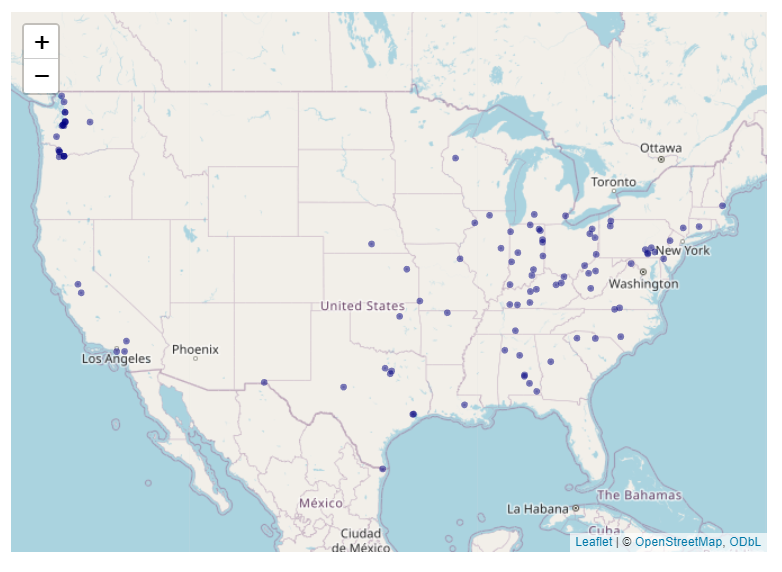
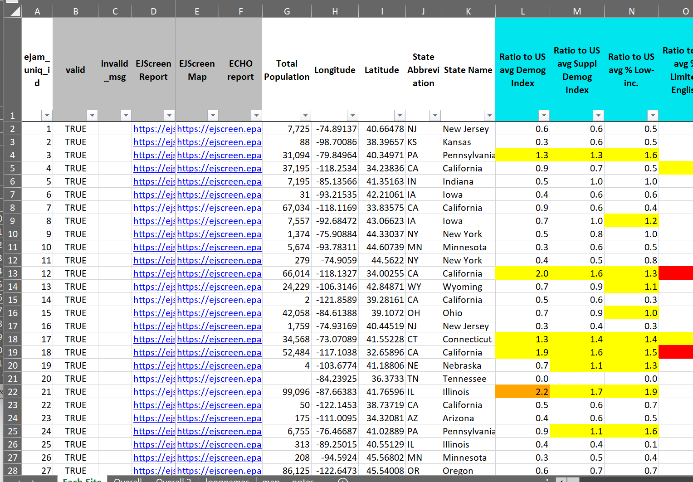

```{r developernote, eval=FALSE, echo= FALSE, include = FALSE}
#  *>>>>>>>>>> Developer note: vignettes need to be tested/edited/rebuilt regularly <<<<<<<<<<<*
#    - **See ?pkgdown::build_site** - EJAM uses the pkgdown R package to build help and articles/ vignettes as web pages
```

```{r SETUP_default_eval_or_not, include = FALSE}
knitr::opts_chunk$set(
  collapse = TRUE,
  comment = "#>"
)
knitr::opts_chunk$set(eval = FALSE)
# https://r-pkgs.org/vignettes.html
```

```{r libraryEJAM, eval = TRUE, echo= FALSE, include= FALSE}
# rm(list = ls())
# golem::detach_all_attached()
# 
library(EJAM)
dataload_from_pins('all') # varnames = all  currently means all these:
# dataload_from_pins(
#   c("blockwts", "blockpoints", "blockid2fips", "quaddata", 
#     "bgej", "bgid2fips",
#     "frs", "frs_by_programid", "frs_by_naics", "frs_by_sic", "frs_by_mact")
# )

##################################### #
# if (!exists("blockid2fips")) {
#   cat("warning: blockid2fips not available\n")
#   # *** temporary workaround if building vignette on 1 particular machine
#   here <- "~/../Downloads/EJAMbigfiles"
#   varnames <- c('blockwts', 'blockpoints', 'blockid2fips', "quaddata",
#                 'bgej','bgid2fips',
#                 'frs', 'frs_by_programid', 'frs_by_naics', "frs_by_sic", "frs_by_mact")
#   fnames <- paste0(varnames, ".arrow")
#   localpaths  <- paste0(here, '/', fnames)
#   for (i in 1:length(varnames)) {
#     if (!exists(varnames[i])) {
#     assign(varnames[i], arrow::read_ipc_file(file = localpaths[i]))
#     }}
#   rm(here, varnames, fnames, localpaths)
# }
##################################### #

indexblocks()

```

# A Brief Intro to Using EJAM in RStudio

After EJAM has been installed (and can access the datasets), here's how you can run an EJAM analysis and view results right away:

## Load EJAM

```{r library, eval=FALSE}
library(EJAM)
```

## Analyze Places with `ejamit()`

If you already have a spreadsheet with columns called lat and lon, you can just do this and EJAM will prompt you to navigate to and select the file and set the radius (from RStudio):

```{r notevaluated, eval=FALSE}
out <- ejamit()
```

If you want to try some test data first:

```{r ejamit100, message=FALSE, warning=FALSE, echo=TRUE, eval=FALSE}
# EJAM analysis of 100 places, for everyone within 3 miles
out <- ejamit(testpoints_100, radius = 3, 
            silentinteractive = F, include_ejindexes = T)
```

## Map with `ejam2map()`

This creates an interactive map. Click a point on the map to see a popup with details about people near that point.

```{r map100, eval = TRUE}
out <- testoutput_ejamit_100pts_1miles
# ejam2map(out)
# or 
mapfastej(out$results_bysite)
```

## Report via `ejam2report()`

```{r eval=FALSE, include=FALSE}
# we should add HTML output in vignette, below, for ejam2report() example
```

```{r ejam2report1, eval=FALSE}
out <- testoutput_ejamit_100pts_1miles

ejam2report(out)
```

{width="100%"}

{width="100%"} {width="100%"}

{width="100%"}

## Barplot

```{r}
# see examples at ?plot_barplot_ratios
```

```{r plot_barplot_ratios, echo = TRUE}

out <- testoutput_ejamit_100pts_1miles

# Check a long list of indicators for any that are elevated

ejam2barplot(out,
  varnames = names_these_ratio_to_avg,
  main = "Envt & Demog Indicators at Selected Sites Compared to State Averages")

ejam2barplot(out,
  varnames = names_these_ratio_to_state_avg,
  main = "Envt & Demog Indicators at Selected Sites Compared to State Averages")

# Demographics only

# vs nationwide avg
ejam2barplot(testoutput_ejamit_100pts_1miles)

# vs statewide avg
ejam2barplot(testoutput_ejamit_1000pts_1miles,
  varnames = c(names_d_ratio_to_state_avg, names_d_subgroups_ratio_to_state_avg),
  main = "Demographics at Selected Sites Compared to State Averages")

# Environmental only

ejam2barplot(testoutput_ejamit_100pts_1miles,
  varnames = c(names_e_ratio_to_avg, names_e_ratio_to_state_avg),
  main = "Environmental Indicators at Selected Sites Compared to Averages")


```

## Spreadsheet from `ejam2excel()`

```{r ejam2excel, eval=FALSE, fig.width=5, message=FALSE, warning=FALSE}
out <- testoutput_ejamit_100pts_1miles

ejam2excel(out, launchexcel = T, save_now = F)
```

{width="100%"}

------------------------------------------------------------------------

# More Examples

## Select Places to Analyze

### Use points already included with EJAM as examples

### Use one point

```{r one point, eval=FALSE}
pts <- data.frame(lon = -92.380556, lat = 31.316944)
```

### Use a few points

```{r sitepoints2, eval = TRUE}
sitepoints2  <- data.frame(
  lon = c(-92.1,      -91.8), 
  lat = c(34.8799123, 30.2906971), 
  sitenumber = 1:2
)
```

### Use test points in examples that comes with the package

EJAM comes with examples of points you can use to try things out:

- [testpoints_10](../reference/testpoints_10.html)
- etc.
```{r eval = TRUE, fig.height=4.83, fig.width=3}
testpoints_10
```

```{r testpoints100, eval = TRUE, echo= TRUE}
testpoints_100 |> head(2) # data.table, in this package
sitepoints100 <- data.table::copy(testpoints_100)  # [1:5, ]
head(sitepoints100, 3)
```

### Create a random sample of points representative of the average facility, average resident, or average area

You can create a set of random points with function `testpoints_n()` that can be weighted to represent the average resident, average regulated facility, average point on a map weighted by square meters, etc. See more details in the documentation of the function `testpoints_n()`.

#### Create random test data points in States of LA and TX

```{r mapfast_testpoints_n, eval = TRUE, fig.height=5, fig.width=5}
# p1k <- testpoints_n(1000)
# mapfast(p1k)

mapfast(testpoints_n(300, ST_needed = c('LA','TX'), weighting = 'bg')) 
# weighting = "frs" better represents regulated facilities,
# but requires loading the (large) frs dataset
```

### Use a table of lat/lon coordinates from a spreadsheet xlsx or csv file

The first row should be column names including lat and lon, or something that can be interpreted as that - see latlon_infer()

```{r writecsv, eval = FALSE, include= TRUE}
testjunk <- file.path(tempdir(), 'testjunk.csv')
write.csv(data.frame(LONG = c(-92.1, -91.8), Latitude = c(34.8, 30.2), ejam_uniq_id = 1:2), file = testjunk, row.names = FALSE)
sitepoints2 <- latlon_from_anything(testjunk)
sitepoints2
```

### Interactively select your own file of lat,lon coordinates, without typing the file name

From RStudio, you can use EJAM functions to interactively select a file from your folders, to upload a spreadsheet (.xlsx or .csv) with columns called lat and lon in the first row as the header row, and then one row per point.

```{r read_csv_or_xl, eval = FALSE}
y <- read_csv_or_xl()
names(y)
head(y)

# or 

# x <- ejamit(radius = 2) 
#  2 mile radius, and 
# prompts you to select spreadsheet with lat,lon values of points
```

------------------------------------------------------------------------

## Map your sites before analyzing them

```{r eval = FALSE}
mapfast(  testpoints_100)                  # input to EJAM
mapfastej(testoutput_ejamit_100pts_1miles) # output, results of EJAM
```

You can see a map of random blocks in a single State, for example:

```{r testpoints_and_map, eval = TRUE, fig.height=6, fig.width=6}
if (exists("blockid2fips")) {
  pts <- testpoints_n(1000, weighting = 'blocks', ST_needed = "LA")
  mapfast(pts, radius = 0.1)
}
```

------------------------------------------------------------------------

## Pick a Radius

You can specify the radius in miles. EJAM will analyze all residents within that many miles of each point (site).

```{r RADIUS, eval = TRUE}
radius <- 3 # radius (in miles).  5 km = 3.1 miles, 10 km = 6.2 miles
```

#### Convert between miles and kilometers

If you know you want to analyze for 5 kilometers, you can turn it into miles with something like

```{r convert units, eval=TRUE}
convert_units(5, 'km', 'miles')
```

------------------------------------------------------------------------

## Analyze your Sites in 1 step with ejamit()

```{r ejamit_testpoints_100, eval=FALSE, message=FALSE, warning=FALSE}
out <- ejamit(testpoints_100, radius = 1) # 1 mile radius around each of 100 test/example points

# help("ejamit")
```

## Map the EJAM Results

Popups in the map show key stats for residents near each site.

```{r mapfastej_out_results_bysite, eval = TRUE, echo= TRUE, fig.height=8, fig.width=6}
out <- testoutput_ejamit_100pts_1miles

mapfastej(out$results_bysite)
# help("mapfast")
```

## See the Summary Report (interactive html file)

```{r eval=FALSE, include=FALSE}
# will add HTML output in vignette below for ejam2report() example 
```

```{r ejam2report2, include=TRUE, eval=FALSE}
out <- testoutput_ejamit_100pts_1miles
x <- ejam2report(out)
y <- ejam2report(out, sitenumber = 1, analysis_title = "EJAM Report on Site Number 1")
```

## See Results as a Spreadsheet (this Launches Excel)

```{r table_xls_from_ejam-launchexcel, eval=FALSE}
ejam2excel(ejamit(testpoints_10, radius = 1), launchexcel = T, save_now = F)
# table_xls_from_ejam()  is another name for  ejam2excel() 
```

### Save Results as a Spreadsheet file

```{r table_xls_from_ejam-savenow, eval=FALSE}
ejam2excel(ejamit(testpoints_10, radius = 1), save_now = T)
```

# Documentation of Functions and Data

- [README on GitHub](https://github.com/USEPA/EJAM/tree/main?tab=readme-ov-file#readme){.uri target="_blank" rel="noreferrer noopener"}
- [Function Reference Document](../reference/index.html){.uri target="_blank" rel="noreferrer noopener"}
- In RStudio, see `?EJAM`

```{r helpEJAM, eval=FALSE, include=TRUE}
?EJAM
# or 
help("EJAM", package='EJAM')

?ejamit()

# If vignettes were including in one's installation (but often are not), then this would work as well:
browseVignettes(package = "EJAM")
```
