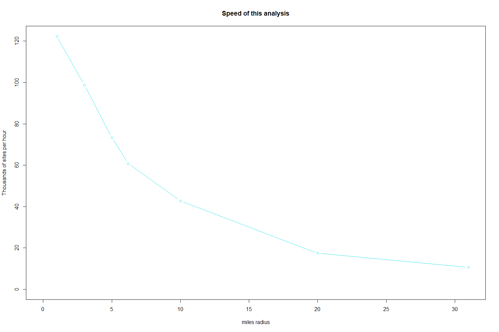

```{r SETUP_default_eval_or_not, include = FALSE}
knitr::opts_chunk$set(
  collapse = TRUE,
  comment = "#>"
)
knitr::opts_chunk$set(eval = FALSE)
# https://r-pkgs.org/vignettes.html
```

```{r libraryEJAM, eval = TRUE, echo= FALSE, include= FALSE}
library(EJAM)
# dataload_from_pins(
#   c('blockwts', 'blockpoints', 'blockid2fips'), 
#    'bgej',     # normally load only if /when needed 
#   'bgid2fips',  # normally load only if /when needed 
#   c('frs', 'frs_by_programid', 'frs_by_naics', "frs_by_sic", "frs_by_mact"), # normally load only if /when needed
#   'quaddata', envir = ?????)
```

```{r developernote, echo= FALSE}
#
#  *>>>>>>>>>> Developer note on updating this vignette <<<<<<<<<<<*
#
#  -   *TO UPDATE THIS VIGNETTE:* 
#
#    - *This vignette must be regularly tested/edited*
#
#    - Do this...   rmarkdown::render("vignettes/EJAM-vignette.Rmd") 
#
#  -    See <https://docs.ropensci.org/postdoc/> for quick way to make html help on a pkg. Do this...   postdoc::render_package_manual('EJAM') 
#
#  -   *See <https://r-pkgs.org/vignettes.html#sec-vignettes-how-built>*
#
#  -   *Vignette is in EJAM\vignettes\EJAM-vignette.html*
```

# EJAM web app

## EJAM web app (easiest way to use EJAM)

You can try a live demo version of the basics of EJAM with just a web browser. You must be inside EPA's network (e.g. using VPN) to access EJAM (the app and code are all internal to EPA's network as of 10/2023).

The complete version of the app is not on a server as of 10/2023, but a working demo of the most basic features -- called "ejam lite" -- is on a staging server at [EJAM Lite (Demo/Test on Staging Server)](https://rstudio-connect.dmap-stage.aws.epa.gov/content/725e3761-3dc1-4012-b07c-23126063da97/ "https://rstudio-connect.dmap-stage.aws.epa.gov/content/725e3761-3dc1-4012-b07c-23126063da97/"){.uri target="_blank" rel="noreferrer noopener"}.

EJAM is in active development, not yet launched as of 10/2023. This is work in progress, so not everything is working and changes are being made!

Note that the demo app takes a long time (maybe 10 seconds, but maybe up 30 seconds, even - this is in flux) to start up and load all the datasets and packages and then build an index. The analysis can be started only after the blue bar lights up to show that the spreadsheet with lat lon values has been uploaded.

## EJAM web app running locally (for R users)

If you use R/RStudio, you can run the web app on your own computer (without internet access, etc.). You first need to install the EJAM R package and related packages, and download related data (or let the app do that for you when it launches). For installation see below.

Once EJAM is installed, you can launch the app from RStudio as follows:

```{r run_app1, eval = FALSE, include= TRUE}
library(EJAM)
run_app()
```

Note this is different than running a simple shiny app that is not also a package via golem. You should use EJAM::run_app() not shiny::runApp().

Note that the web app (e.g., launched locally) handles loading datasets and indexing blocks, so you would not have to download datasets manually or do indexing manually if launching the EJAM app locally. You just need the packages installed that EJAM relies on (see below).

The EJAM R package and app are in active development, not yet launched as of 10/2023. EJAM is in active development, not yet launched as of 10/2023. This is work in progress, so not everything is working and changes are being made!

Use of the web app is documented elsewhere, not in this vignette.

# EJAM Setup for R users

EJAM is not only a web app built in shiny R, it is also an R package, using the [golem](https://thinkr-open.github.io/golem/ "https://thinkr-open.github.io/golem/"){.uri target="_blank" rel="noreferrer noopener"} framework.

The development version of the app can be installed from the github USEPA github repository. It can be installed locally as an R package, and the data or functions can be used outside of the shiny app interface, if you want to reuse data or code, or want to do customized analysis or explore the data in R.

## Install the EJAM R package (and related EJAM packages)

### Get access to EPA's internal GitHub repositories

To install the latest development version of EJAM, you will first need to make sure you have access to the GitHub repositories on EPA's enterprise github site, at [USEPA GitHub](https://github.com/USEPA "https://github.com/USEPA"){.uri target="_blank" rel="noreferrer noopener"}. **You need to use VPN or be inside the EPA LAN at the office.**

### to install directly from GitHub, starting from RStudio

If you know how to clone and build from source in RStudio, feel free to skip ahead to that topic.

If you just want to install EJAM but not work with source code, you can try this approach:

Try to install the packages using `devtools::install_github()` like this (which will download and build from source, automatically):

``` r
if (!require(devtools)) {install.packages("devtools")}
devtools::install_github('USEPA/EJAMejscreenapi')
devtools::install_github('USEPA/EJAMbatch.summarizer')
devtools::install_github('USEPA/EJAM')
```

If that does not work, you might need to do the following:

    1.  create GitHub personal access token with 'repo scope'

        - Go to [https://github.com/settings/tokens](https://github.com/settings/tokens){.uri target="_blank" rel="noreferrer noopener"} and select Tokens (classic) on the left-hand side. Then click 'Generate New Token' -\> Generate new token (classic).
        - Give it a name and select all boxes under repo scope. Scroll down and click 'Generate Token'.

    2.  set GitHub credentials in Rstudio

        - one-time login: from the console, run credentials::set_github_pat(). Paste in your PAT to the login popup under 'Token'.
        - store credentials long-term: run usethis::edit_r\_environ() to open your .Renviron file and and add a line with your PAT in this format: GITHUB_PAT = 'abc'
        - You can specify an extra argument scope = 'project' if you only want the PAT to work for a particular Rstudio project.

3.  Install the packages using `devtools::install_github()`

``` r
if (!require(devtools)) {install.packages("devtools")}
devtools::install_github('USEPA/EJAMejscreenapi')
devtools::install_github('USEPA/EJAMbatch.summarizer')
devtools::install_github('USEPA/EJAM')
```

### if you need the full source code and want to build/install in RStudio on your own

There are 3 EJAM-specific packages as of 10/2023 that EJAM needs, all of which are in EPA-internal repositories:

Essential packages only available on the [USEPA github](https://github.com/USEPA/EJAM "github.com/USEPA/EJAM"){.uri target="_blank" rel="noreferrer noopener"} (not CRAN) are:

    * [EJAM](https://github.com/USEPA/EJAM#readme "github.com/USEPA/EJAM"){.uri target="_blank" rel="noreferrer noopener"}
    * [EJAMejscreenapi](https://github.com/USEPA/EJAMejscreenapi#readme "github.com/USEPA/EJAMejscreenapi"){.uri target="_blank" rel="noreferrer noopener"}
    * [EJAMbatch.summarizer](https://github.com/USEPA/EJAMbatch.summarizer#readme "github.com/USEPA/EJAMbatch.summarizer"){.uri target="_blank" rel="noreferrer noopener"}

Options for getting the source package:

    a. One way to get each source package is that in RStudio you can click New Project, Version Control, Git, and enter the repository URL. It will download the full source package, which has additional files related to development that you do not need if you just want to use the package.

    b. Yet another way to get the full source package is to use a browser to go to the repository page, such as [USEPA github](https://github.com/USEPA/EJAM "github.com/USEPA/EJAM"){.uri target="_blank" rel="noreferrer noopener"}  and then click the green "Code" button, and download and unzip the zip file that contains the package.

    c. A third way is to Clone or Fork the package via GitHub Desktop or from the GitHub site.

Regardless of how you got the full source code, you would then need to build/install the package from source on your computer using RStudio menus or using the devtools package, for example.

#### CRAN packages needed

EJAM needs a few other packages that are available from CRAN. Trying to load/attach EJAM with require(EJAM) or library(EJAM) will alert you to those other packages you need to install if you don't already have them.

You could also see the list of CRAN packages needed by looking at the `DESCRIPTION` file in the R package.

## Initialize: load/attach package, download block data, build index

Once the right R packages are installed, to use EJAM in the console you can start by loading and attaching the package, using library or require.

```{r libraryejam, eval=TRUE}
require(EJAM)
```

To work in the RStudio console, you need to load the datasets (which are stored in AWS Data Commons, at least during EJAM development).

```{r dataload_from_aws, eval = TRUE}
dataload_from_pins()
# It takes some time (maybe 30 to 60 seconds) for the large downloads, while EJAM is still in development.
```

You also need to build the index of millions of US block locations, which takes a few seconds. Or you could just try to use some functions like ejamit() which will do the indexing if not already done.

```{r indexblocks, eval=TRUE}
indexblocks()
```

You can save a little time if you first save those datasets locally and in later sessions have EJAM read them from your local drive instead of re-downloading from AWS.

```{r eval = FALSE}
dataload_from_pins() # do this once, then save data locally so future sessions start faster
dir.create("~/mydata") # for example
datawrite_to_local(folder_local_source = "~/mydata")

help("dataload_from_local")

help("datawrite_to_local")
```

# EJAM Analysis in R

## Quick Start

Here's how you can run an EJAM analysis and view results right away (once EJAM has been set up)

```{r quicksummary, eval = FALSE}
library(EJAM)
cat('Ready to run analyses\n')

# one point
pts <- data.frame(lon = -92.380556, lat = 31.316944)

# 100 points example
pts <- testpoints_100

x <- ejamit(pts, radius = 3, silentinteractive = T)
# Some key results in a table
table_gt_from_ejamit(x) 
# launches Excel with complete results
wb <- ejam2excel(x, launchexcel = T, save_now = F) 
# click a point to see popup on map
mapfastej(x$results_bysite)
```

## Specify Points to Analyze

### Use points already included with EJAM as examples

EJAM comes with examples of points you can use to try things out, like `testpoints_10`

```{r eval = TRUE, fig.height=4.83, fig.width=3}
testpoints_10
```

### Use one point

```{r one point, eval=FALSE}
pts <- data.frame(lon = -92.380556, lat = 31.316944)
```

### Use a few points

```{r sitepoints2, eval = TRUE}
sitepoints2  <- data.frame(
  lon = c(-92.1,      -91.8), 
  lat = c(34.8799123, 30.2906971), 
  siteid = 1:2
)
```

### Use a random sample of points that can represent the average facility, average resident, or average location

You can create a set of random points with function `testpoints_n()` that can be weighted to represent the average resident, average regulated facility, average point on a map weighted by square meters, etc. See more details in the documentation of the function testpoints_n().

```{r help_testpoints, eval = FALSE}
?testpoints_n
```

### Map your sites before analyzing them

```{r eval = FALSE}
mapfast(  testpoints_100)                  # input to EJAM
mapfastej(testoutput_ejamit_100pts_1miles) # output, results of EJAM
```

You can see a map of random blocks in a single State, for example:

```{r eval = TRUE, fig.height=6, fig.width=6}
pts <- testpoints_n(1000, weighting = 'blocks', ST_needed = "LA")
mapfast(pts, radius = 0.1)

```

### Pick a Radius

You can specify the radius in miles. EJAM will analyze all residents within that many miles of each point (site).

```{r RADIUS, eval = TRUE}
radius <- 3 # radius (in miles).  5 km = 3.1 miles, 10 km = 6.2 miles
```

##### Convert between miles and kilometers

If you know you want to analyze for 5 kilometers, you can turn it into miles with something like

```{r convert units, eval=TRUE}
convert_units(5, 'km', 'miles')
```

## Analyze your Sites in 1 step with ejamit()

```{r eval = TRUE, echo= TRUE}
x <- ejamit(testpoints_100, radius = 1) # 1 mile radius around each of 100 test/example points

# help("ejamit")
```

### Interactively select your own file of lat,lon coordinates, without shiny web app

From RStudio, you can use EJAM functions to interactively select a file from your folders, to upload a spreadsheet (.xlsx or .csv) with columns called lat and lon in the first row as the header row, and then one row per point.

```{r read_csv_or_xl, eval = FALSE}
y <- read_csv_or_xl()
names(y)
head(y)

# or 

x <- ejamit(radius = 2) #  2 mile radius, and prompts you to select spreadsheet with lat,lon values of points
```

### Map the EJAM Results

Popups in the map show key stats for residents near each site.

```{r eval = TRUE, echo= TRUE, fig.height=8, fig.width=6}
mapfastej(x$results_bysite)
# help("mapfast")
```

### Open Results as a Spreadsheet (this Launches Excel)

```{r table_xls_from_ejam-launchexcel, eval = FALSE}
ejam2excel(ejamit(testpoints_10, radius = 1), launchexcel = T, save_now = F)
# table_xls_from_ejam()  is another name for  ejam2excel() 
```

### Save Results as Spreadsheet file

```{r table_xls_from_ejam-savenow, eval = FALSE}
ejam2excel(ejamit(testpoints_10, radius = 1), save_now = T)
```

=============

##### Use lat/lon coordinates in a table like a spreadsheet - xlsx or csv file

The first row should be column names including lat and lon, or something that can be interpreted as that - see latlon_infer()

```{r writecsv, eval = FALSE, include= TRUE}
testjunk <- file.path(tempdir(), 'testjunk.csv')
write.csv(data.frame(LONG = c(-92.1, -91.8), Latitude = c(34.8, 30.2), siteid = 1:2), file = testjunk, row.names = FALSE)
sitepoints2 <- latlon_from_anything(testjunk)
sitepoints2
```

##### Use test points in examples that comes with the package

```{r testpoints100, eval = TRUE, echo= TRUE}
testpoints_100 |> head(2) # data.table, in this package
sitepoints100 <- data.table::copy(testpoints_100)  # [1:5, ]
head(sitepoints100, 3)
```

##### Create random test data points in States of LA and TX

```{r mapfast_testpoints_n, eval = TRUE, fig.height=5, fig.width=5}
# ?testpoints_n
# p1k <- testpoints_n(1000)
# mapfast(p1k)

mapfast(testpoints_n(300, ST_needed = c('LA','TX'), weighting = 'bg')) 
# weighting = "frs" would better represent regulated facilities,
# but would require loading the frs dataset
```

============

## See Documentation of Functions and Data

See the readme for links to more documentation. There is documentation for the package overall, and individual functions and datasets.

```{r helpEJAM, eval = FALSE, include= FALSE}
?EJAM
# or 
help("EJAM", package='EJAM')

?ejamit
```

------------------------------------------------------------------------

## More about picking places to analyze in EJAM

### Specify points (where you want to center the circular buffers)

You can define locations as all residents within X miles of any one or more of the specified points, and you can define those points in a few ways. One way is to upload a table of coordinates -- latitude and longitude for each point, one row per site, with columns called lat and lon (or some synonyms that work).

The simplest way tfo do that in the RStudio console is to do something like x \<- ejamit(radius=1), and it prompts you to upload a spreadsheet with lat lon columns.

You can also specify a set of facilities by uploading their Registry ID numbers in a table, or using other identifiers. For example, there is a function latlon_from_programid().

You can define circular buffers around a set of EPA-regulated facilities in a few other ways as well, such as by NAICS (or SIC) industry names or codes, EPA program covering the set of facilities (e.g., all greenhouse gas reporters), or a Clean Air Act MACT subpart.

### Specify all sites in 1 industrial sector

You can specify sites by NAICS, but it is important to note the FRS lacks NAICS info for many regulated facilities!

```{r naics_from_any, eval = TRUE}
naics_from_any("paint and coating", children = T)
# note latlon_from_naics() requires the frs_by_naics dataset, which it tries to load on demand.
head(latlon_from_naics(325510)) # has about 1,000 facilities

## All sectors with this phrase in their NAICS title
#
#  x <- ejamit(frs_from_naics("paint and coating"), 1)


```

### Specify sites by Facility Registry ID

```{r frs_from_siteid, eval = FALSE}
# note frs_from_siteid() and latlon_from_regid() require the frs dataset, which they try to load on demand.

frs_from_siteid(c(110071293460, 110000333826))

## interactively upload file with table of REGISTRY_ID values
x <- latlon_from_regid(read_csv_or_xl()$REGISTRY_ID)

## and run through EJAM
y <- ejamit(latlon_from_regid(read_csv_or_xl()$REGISTRY_ID), radius = 1)
#  # still debugging Island Areas validation here!
```

### Specify sites by Facility ID (program system ID)

```{r latlon_from_programid, eval = TRUE}
# note latlon_from_programid() requires the frs_by_programid dataset, which it tries to load on demand.

latlon_from_programid(c("XJW000012435", "00768SRTRSROAD1"))
```

### Specify sites by EPA regulatory program or EPA database

```{r latlon_from_program, eval = TRUE}
# note latlon_from_programid() requires the frs and frs_by_programid datasets, which it tries to load on demand.

head(cbind(Count.of.facilities = sort(table(frs_by_programid$program), decreasing = T)), 20)

latlon_from_program("CAMDBS")[,1:6]
```

### Specify sites by EPA MACT Subpart in Clean Air Act

```{r latlon_from_mactsubpart, eval = TRUE}
# note latlon_from_mactsubpart() requires the frs_by_mact dataset, which it tries to load on demand

latlon_from_mactsubpart("OOOO")

nrow(latlon_from_mactsubpart("OOOO", include_if_no_latlon = FALSE))

nrow(latlon_from_mactsubpart("OOOO", include_if_no_latlon = TRUE))
```

### MORE EXAMPLES OF SELECTING SITES BY NAICS

#### NAICS Codes to Map or Analyze Facilities in one Industrial Sector

Quick map of EPA-regulated facilities in one industrial category, which you can click on to see popup windows about sites.

```{r mapfast(frs_from_naics), eval = TRUE, fig.height=5, fig.width=5}
# note frs_from_naics() requires the frs dataset, which it tries to load on demand.

mapfast(frs_from_naics("smelt")) # may be slow the 1st time, if it loads frs dataset
```

(but note that this FRS dataset lacks NAICS for most facilities!)

Table of facilities in an industry, plus links to each facility in ECHO and EJScreen

```{r frs_from_naics-chemicalmanuf, eval = FALSE}
industryword <- "chemical manuf"
#  industryword <- "smelt"

mysites <- frs_from_naics(industryword, children = FALSE)[,1:5]

regids <- mysites$REGISTRY_ID
link1 <- url_echo_facility_webpage(regids, as_html = T)
link2 <- url_ejscreen_report(lat = mysites$lat, lon = mysites$lon, radius = 3, as_html = T)
link3 <- url_ejscreenmap(lat = mysites$lat, lon = mysites$lon,  as_html = T)
# # same:
# my_industry <- naics_from_any("chemical manuf",children = F)[,.(code,name)]
# mysites <- frs_from_naics(my_industry$code)[,1:5]
mysites <- cbind(`ECHO report` = link1, 
                 `EJScreen Report` = link2, `EJScreen Map` = link3,
                 mysites)
 caption = paste0(nrow(mysites), ' sites have NAICS matching "', industryword, '"')
if (nrow(mysites) > 1500) {mysites <- mysites[1:1500, ]} # >2k rows is too much for client-side DataTables
 cat(caption,'\n')

 print(
  DT::datatable(
    mysites,
    escape = FALSE,     rownames = FALSE,
    caption = caption,
    filter = "top"
  )[1:10, ]
)
```

Map of facilities in an industry, plus popups with links to each facility in ECHO and EJScreen

```{r map2, eval = FALSE, fig.height=5, fig.width=5}
mapfast(mysites)
```

NAICS/industry categories

```{r pulpindustry, eval = TRUE}
naics_categories()
naics_from_any(naics_categories(3))[order(name),.(name,code)][1:10,]
naics_from_any(naics_categories(3))[order(code),.(code,name)][1:10,]

# See a data table of facilities in one industry
industryword <- "pulp"
head( frs_from_naics(naics_from_any(industryword)$code)[,1:4] )
```

Search using industry codes or text in industry names

```{r plastics-and-rubber, eval = TRUE}
naics_from_any("plastics and rubber") 

naics_from_any(326)

head(naics_from_any(326, children = T)[,.(code,name)])

naics_from_any("pig") 
naics_from_any("pig ") # space after g

# a OR b,  a AND b,  etc.
a = naics_from_any("plastics")

b = naics_from_any("rubber")

library(data.table)
data.table::fintersect(a,b)[,.(name,code)] #  a AND b

head(data.table::funion(a,b)[,.(name,code)])     #  a OR  b

naics_subcodes_from_code(funion(a,b)[,code])[,.(name,code)]   #  plus children

head(naics_from_any(funion(a,b)[,code], children = T)[,.(name,code)] ) #  same
```

A NAICS code can have many "children" or subcategories under it

```{r frs_from_naics-details, eval = TRUE}
NROW(naics_from_any("chem"))
# about 20
NROW(naics_from_any("chem", children = T))
# >100
NROW(frs_from_naics(naics_from_any("chem")$code))
# a few thousand
 NROW(frs_from_naics(naics_from_any("chem", children = T)$code))
# >10,000
```

### Key Functions underlying EJAM

-   **run_app()** to launch the web app locally

    -   A couple of functions help load data files, like dataload_from_local(), dataload_from_pins(), etc.
    -   Files with lat/lon data may be imported with latlon_from_anything () or read_csv_or_xl()
    -   Several functions help work with lat/lon pairs: latlon_df

-   **ejamit()** provides most results in just one function, by using getblocksnearby() and doaggregate():

    -   **getblocksnearby()** takes a set of points (e.g., facilities) and finds the Census blocks near each. Sample input is in testpoints_100, and sample output is in testoutput_getblocksnearby_10pts_1miles

    -   **doaggregate()** takes the list of blocks near each point, joins it to blockgroup indicators like from EJScreen, and aggregates at each buffered point as well as for the overall set of unique blocks (residents). Sample input is in testoutput_getblocksnearby_10pts_1miles

        -   

### Speed tests for EJAM analysis

EJAM is designed to provide results for large numbers of sites very quickly, so it can analyze well over 100,000 sites per hour, and can analyze 1,000 sites in something like 10 to 20 seconds (assuming it has already been initialized with loaded data and indexing, which needs to be done once up front and can take a minute).

```{r speedtest, eval = FALSE, echo= TRUE, fig.height=3, fig.width=5}
speeds = EJAM::speedtest(n = 100, radii = c(1,3,5,6.2,10))
```

{width="5in"}

```{r speedreport1000, eval = TRUE}
## ejamit() just combines getblocksnearby() and doaggregate()
sitepoints <- testpoints_1000
# elapsed <- system.time({
began = Sys.time()
  out2 <- ejamit(
    sitepoints =  sitepoints  ,
    radius = radius
  )
  speedreport(began, Sys.time(), n = NROW(sitepoints))
# })
# print(elapsed)
```

## Site by site results in datatable format in RStudio viewer:

```{r datatable30}
 DT::datatable(out2$results_bysite[1:30,   ], escape = FALSE, rownames = FALSE)

# To see all 1,000 sites in table:
#DT::datatable(out2$results_bysite[1:1000, ], escape = FALSE, rownames = FALSE)
```

### Overall results for a few key indicators, as raw output in console:

```{r cbind-overall, eval = TRUE, paged.print= TRUE}
names(out2)
cbind(overall = as.list( out2$results_overall[ , ..names_d]))
cbind(overall = as.list( out2$results_overall[ , ..names_d_subgroups]))
```

### Overall results for the very long list of all indicators, as raw output in console:

```{r}
cbind(as.list(out2$results_overall))
```

### Specify Places or Shapes

#### Polygons in shapefiles as the places to compare

You can upload polygons in a shapefile, and use EJAM to analyze them. See the Shiny app.

#### Counties as the places to compare

You can compare places defined by FIPS code, such as a group of US Counties.

Compare all Counties in a State, using EJAM indicators

```{r counties_fips, eval = FALSE}

# Get FIPS of each county in Delaware
mystate <- "Delaware"
cfips <- fips_counties_from_statename(mystate)

## You could launch a web browser tab for each of the counties,
##  to see each of the County reports from EJScreen, like this:
#
# sapply(url_ejscreen_report(areaid = cfips), browseURL)

## Analyze EJ stats for each county in the State

x <- ejamit(fips = cfips) # radius not used
DT::datatable(x$results_bysite, escape = F)

table_tall_from_overall(x$results_overall)

t(x$results_bysite[ , c(
 'siteid', 'pop', names_d_subgroups_ratio_to_state_avg), with = F])

mapfastej_counties(x$results_bysite)

 cnames <- fips2countyname(x$results_bysite$siteid)
#cnames <- c("Kent County", "New Castle County", "Sussex County")
#cnames <- gsub(" County", "", cnames)

barplot(x$results_bysite$pctlowinc, names.arg = cnames,
       main = paste0('% Low Income by County in ', mystate))

# Another example
mystate <- "Maryland"
vname <- "% low income"
xmd <- ejamit(fips = fips_counties_from_statename(mystate))
ggblanket::gg_col(data = xmd$results_bysite,
                 y = pctlowinc,
                 x = siteid,
                 title = paste0(vname, ' by County in ', mystate),
                 y_title = vname
                 )

mapfastej_counties(xmd$results_bysite, 'state.pctile.pctlowinc')

```

### Get granular results step by step, and view details

#### getblocksnearby() will find residents/blocks that are within specified distance

About \< 1 second for 100 sites, but a few seconds for 1,000 sites, or roughly 500k / hour for this step

```{r getblocksnearby1, eval = FALSE}
sitepoints <- data.table::copy(testpoints_100) 
# or 
# sitepoints <- testpoints_n(100,"block") # random points
radius <- 3
elapsed <- system.time({
  
  sites2blocks <- getblocksnearby(
    sitepoints = sitepoints,
    radius = radius
  )
  
}) # end of timed function
print(elapsed)
sites2blocks
```

#### Info about the blocks found near 1 site

```{r plotblocksnearby2, eval = FALSE, fig.height=5, fig.width=5}
x = plotblocksnearby(testpoints_n(1), radius = 3, returnmap = FALSE)
#  returnmap= TRUE is to actually return the leaflet map 

```

#### View detailed diagnostics or stats on the intermediate result

-   what blocks are near each site
-   how far are they
-   how many blocks are typically near a given site (population density varies a lot)
-   how many sites are near a block (residents who have more than 1 site near them)

```{r getblocksnearby2, eval = TRUE}
## Also could use this example intermediate step dataset 
## of n sites, with thousands of nearby blocks:
# sites2blocks <- data.table::copy(testoutput_getblocksnearby_10pts_1miles)
radius <- 3
sitepoints <- data.table::copy(testpoints_100) 
sites2blocks <- getblocksnearby(sitepoints, radius, quadtree = localtree)
names(sites2blocks)
getblocks_summarize_blocks_per_site(sites2blocks) # print() shows more info returned invisibly
getblocks_diagnostics(sites2blocks)
# Use data.table package here
library(data.table)
# Very few blocks are within a radius of 1/4 mile.
# Hundreds are often within 1 mile, but sometimes there are only a handful or even zero.
s2b_stats <- sites2blocks[ , .(
  avgDistance = round(mean(distance), 2),
  blocksfound = .N, 
  blocks_within_1mile = sum(distance <= 1),
  blocks_within_0.75   = sum(distance <= 0.75),
  blocks_within_0.25  = sum(distance <= 0.25)
), by = 'siteid'][order(blocksfound), ]
setorder(s2b_stats, siteid)
head(s2b_stats)

```

```{r plot_count_of_blocks_nearby, eval=TRUE, fig.height=6, fig.width=5}

# CDF of how many blocks are nearby a site
plot(sort(s2b_stats$blocks_within_1mile), 
     main = "How many blocks are near each facility?", 
     ylab = "# of blocks (whose internal point is) within 1 mile of each facility", 
     xlab = paste0(nrow(s2b_stats), " facilities ranked by # of blocks nearby"))
abline(h = quantile(s2b_stats$blocks_within_1mile, probs = (0:4) * 0.25))
abline(h = mean(s2b_stats$blocks_within_1mile), col = "red")


```

```{r histoblocks, eval=TRUE, fig.height=6, fig.width=7}
# Histogram of how many blocks are nearby a site
hist(sites2blocks[,.N,by = "siteid"][,N],20, 
     xlab = "How many blocks are nearby?", 
     ylab = "Frequency (# of sites)", 
     main = "A given site may have zero to hundreds of blocks nearby", 
     sub = "A typical site in this example has about 100 blocks nearby")
```

```{r DTdatatable, eval = FALSE}

DT::datatable(s2b_stats,  rownames = FALSE)
# more summaries showing there may be only 1 block or several hundred blocks within 1 mile
quantile(s2b_stats$blocks_within_1mile, probs = (0:4) * 0.25)
t(summary(s2b_stats))
```

```{r s2b_stats, eval = TRUE, fig.height=5, fig.width=5}
# map the sites with popups about how many blocks were found near each
if (!('siteid' %in% names(sitepoints))) {sitepoints$siteid <- seq.int(length.out = NROW(sitepoints))}
s2b_stats <- merge(sitepoints, s2b_stats, by = "siteid")
mapfast(s2b_stats, radius = radius)
```

#### Site vary widely in how many blocks are nearby, depending on population density

```{r eval = TRUE, fig.height=5, fig.width=5}

# Some places have very few -- if any -- blocks within 1 mile

tail(s2b_stats[order(s2b_stats$blocks_within_1mile, decreasing = T), 
               c('siteid', 'blocks_within_1mile')], 3) 

# Some places have hundreds nearby: a 1 mile radius is huge within a dense urban area

head(s2b_stats[order(s2b_stats$blocks_within_1mile, decreasing = T), 
               c('siteid', 'blocks_within_1mile')], 3)
densest <- s2b_stats$siteid[order(s2b_stats$blocks_within_1mile, decreasing = T)][1]
plotblocksnearby(sitepoints = sitepoints[sitepoints$siteid == densest, ])
```

```{r eval = TRUE}
# Within a 1 mile radius, the blocks found tend to be about 2/3 of a mile from the site at the center.
summary(s2b_stats$avgDistance)
```

#### doaggregate() will summarize indicators within each buffer and overall

```{r doaggregateX, eval = TRUE}
# out <- doaggregate(testoutput_getblocksnearby_10pts_1miles)

elapsed <- system.time({
  out <- suppressWarnings( 
    doaggregate(sites2blocks = sites2blocks) 
  )
}) 
print(elapsed)

names(out)
dim(out$results_bysite)
```

#### See indicators aggregated over all people across all sites

```{r cbindagain, eval = TRUE}
## view output of batch run aggregation ####
cbind(overall = as.list( out$results_overall))

## To see just some subset of indicators, like Environmental only:
cbind(overall = as.list( out$results_overall[ , ..names_e]))
cbind(overall = as.list( out$results_overall[ , ..names_d]))
cbind(overall = as.list( out$results_overall[ , ..names_d_subgroups]))
cbind(overall = as.list( out$results_overall[ , ..names_e_pctile]))
cbind(overall = as.list( out$results_overall[ , ..names_d_pctile]))
# cbind(overall = as.list( out$results_overall[ , ..names_ej_pctile]))
```

#### Histogram of indicators distribution over all people across all sites

```{r histo, eval = TRUE}
hist(out$results_bysite$pctile.traffic.score, 10, xlab = "Local traffic scores (expressed as a percentile)", 
     ylab = "count of sites in each bin, out of 1,000 sites", freq = TRUE, 
     main = "Actual distribution of indicators nearby, as percentiles, vs flat line = USA overall")
abline(h = nrow(out$results_bysite)/10)
```

# The EJScreen API module

The EJAMejscreen package was used to create a shiny module in EJAM that provides access to the EJScreen API in a loop or batch mode. It uses EJScreen to run reports on multiple places one at a time, so it is somewhat slow for more than a handful of places, but exactly replicates EJScreen results.

### Just see the EJScreen report for one site

This works best for one site at a time, and does not provide results in a table, just a formatted web page EJScreen Community Report directly from EJScreen.

```{r browseURL, eval=FALSE}

# Browser opens to view one site report
browseURL(
  url_ejscreen_report(
    lon = -92.380556, 
    lat = 31.316944, 
    radius = 3
  )
)

# Get the URL for each site report
url_ejscreen_report(
  lon = testpoints_10$lon, 
  lat = testpoints_10$lat, 
  radius = 3
  )

# Open each webpage in a browser
for (i in 1:2) {
  browseURL(url_ejscreen_report(
  lon = testpoints_10$lon[1:2], 
  lat = testpoints_10$lat[1:2], 
  radius = 3)[i])
  }
```

### Get EJScreen results for a batch of sites, from RStudio

In RStudio, you can use EJAM's EJScreen API code like this:

```{r ejscreenit-interactive, eval = FALSE}

# To interactively pick your own spreadsheet file from your local drive, that has lat and lon as two column headings and then one row per site:

x <- ejscreenit(radius = 1) # will prompt you for excel file with lat lon in it
```

```{r ejscreenit-2points, eval = FALSE}
x <- ejscreenit(data.frame(lon = c(-111,-113), lat = c(41,43)), radius = 2)
names(x)
x$map
x$table
ejscreenit_see_table(x)
```

### Get EJScreen results running a local web app \*\*\*not tested

```{r run_app_EJAMejscreenapi, eval = FALSE}
### *** NOT TESTED - MAY NO LONGER WORK AS SHIFT TO USING MODULE VERSION
# If you have the local source package EJAMejscreenapi you can do this:
# setwd("YOUR PATH GOES HERE  EJAMejscreenapi")
library(EJAMejscreenapi)
EJAMejscreenapi::run_app()
```

### Get EJScreen results running a local web app module \*\*\*not tested

```{r api_module, eval = FALSE}
library(EJAMejscreenapi) 
library(shiny); library(magrittr); library(leaflet)  
# must attach all of those manually for this to work?
source(system.file("global.R", package = "EJAMejscreenapi"))
default_calculate_ratios <- TRUE
use_ejscreenit_tf <- FALSE
######################### #
  TEST_UI <- function(request) {
    shiny::fluidPage(
      tabsetPanel(
        tabPanel(
          title = "api app",
          shiny::h2('EJScreen API batch tool packaged with EJAM'), 
 # EJAM:::mod_ejscreenapi_ui("TESTID", simpleradius_default_for_ui = 2),
          mod_ejscreenapi_ui("TESTID", simpleradius_default_for_ui = 2),
          br()
        )))
    }
######################### #
  TEST_SERVER <- function(input, output, session) {
#x <- EJAM:::mod_ejscreenapi_server(
    x <-     mod_ejscreenapi_server(
      "TESTID", 
      default_points_shown_at_startup_react = reactive(testpoints_5[1:2,]),
      use_ejscreenit = use_ejscreenit_tf
    )
    output$testinfo2 <- renderText(
      cat("x names:  ", paste0(names(x()), collapse = ", "), "\n")
      )
    output$results <- DT::renderDataTable({x()}, 
      options = list(
        selection = 'multiple',
        dom = 'rtip', # specify 4 DOM elements: 
        # processing, table, info, pagination 
        # per https://datatables.net/examples/basic_init/dom.html
        scrollX = TRUE, 
        searchPanes = TRUE  # does this work?
      ),
      escape = FALSE 
    )
    # *** CAUTION ***
    # escape= TRUE is better for security reasons (XSS attacks).
    # escape= FALSE lets ejscreen URL links work, 
    #   but not links from ECHO table download.
  }
######################### #
  
shinyApp(ui = TEST_UI, server = TEST_SERVER) # Try module in mini/test app
```

### Compare to results from EJScreen API

```{r ejamit-testpoints_1000, eval = FALSE}
sitepoints <- testpoints_1000 
radius <- 1

outejam <- ejamit(sitepoints =  sitepoints[1:5, ], radius = radius)

## SLOW

outapi <- (ejscreenit(sitepoints[1:5, ],
                     radius = radius,
                     nosave = T, nosee = T,
                     interactiveprompt = F))$table
names(outapi)

cbind(as.list(outapi[1, ]))

# outapi2 <- ejscreenapi_plus(sitepoints[1:5, ], radius = radius, 
#     on_server_so_dont_save_files = T)

setdiff( names(outapi$table), names(outejam$results_overall))

setdiff( names(outejam$results_overall), names(outapi$table))

# links to report or map also were named differently.

 cat("----------------\n")


#   
```
